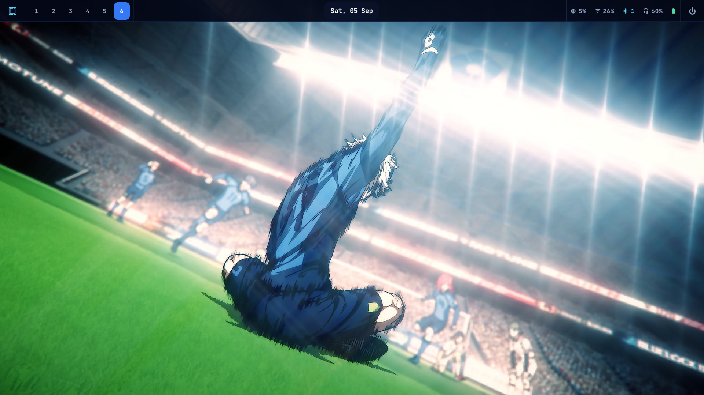
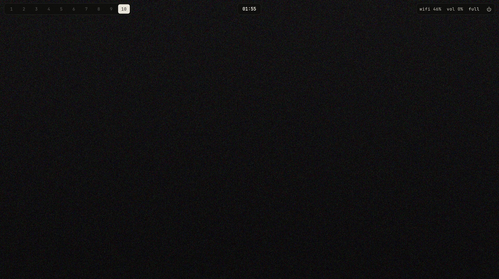
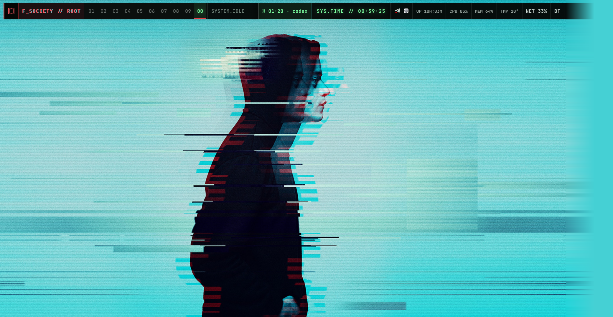

# Omarchy Themes

A collection of complete themes for [Omarchy](https://omarchy.org/), including
*Blue Lock*, *Mr. Robot*, and the original minimalist theme *Minimal Drift*.
All themes target Omarchy 4.

## Blue Lock



*Live desktop preview showing the restrained navy Waybar, numbered workspaces,
centered clock, compact system status, and stadium wallpaper.*

A dark football-inspired theme built around deep navy surfaces, electric-blue
active states, soft cyan details, and a clean full-width Waybar. It includes
three 1920px wallpapers and complete native-shell styling. Install with
`./install.sh blue-lock`; details are in [blue_lock/](blue_lock/).

## Minimal Drift



*Live desktop preview showing the floating-pill Waybar, bone active
workspace, and warm-monochrome terminal palette.*

Warm grays, one bone accent, one sand warning. Slim floating pill bar with
hairline borders and strict module density (numbered workspaces, clock,
network, volume, battery, power — nothing else), six generated gradient
wallpapers including near-black variants, and full native-shell styling.
Install with `./install.sh minimal-drift` (see below);
details in [minimal_drift/](minimal_drift/).

## Mr. Robot



*Live desktop preview showing the custom fsociety Waybar, workspace states,
Pomodoro session, system telemetry, and glitch wallpaper.*

The theme combines near-black terminal surfaces, fsociety red alerts,
phosphor-green interaction states, cyan glitch accents, seven wallpapers, and
a custom telemetry-heavy Waybar.

### Quick installation

```bash
bash <(curl -fsSL https://raw.githubusercontent.com/yadavayush834/omarchy-themes/main/install.sh) blue-lock
```

Or pick a theme explicitly (defaults to `mr-robot` when omitted):

```bash
./install.sh blue-lock
./install.sh minimal-drift
./install.sh mr-robot
```

The installer:

- downloads this repository when needed;
- validates the theme name against a fixed list (`blue-lock`, `mr-robot`,
  `minimal-drift`);
- backs up an existing theme instead of deleting it;
- installs the theme folder as `~/.config/omarchy/themes/<slug>`;
- applies the theme with Omarchy.

If you prefer to inspect everything first:

```bash
git clone --depth 1 https://github.com/yadavayush834/omarchy-themes.git
cd omarchy-themes
./install.sh blue-lock
```

Cycle wallpapers after installation with:

```bash
omarchy theme bg next
```

### Waybar compatibility

Each theme can bundle a complete layout under its own `waybar/` directory. A
compatible Waybar theme manager can activate it automatically; standard
Omarchy installations still receive the complete native-shell styling and
color palette.

## Repository layout

```text
omarchy-themes/
├── install.sh
├── README.md
├── screenshots/
│   ├── blue-lock-desktop.png
│   ├── minimal-drift-desktop-v2.png
│   └── mr-robot-desktop.png
├── blue_lock/            # slug: blue-lock
│   ├── backgrounds/
│   ├── colors.toml
│   ├── shell.*.toml
│   └── waybar/
├── minimal_drift/        # slug: minimal-drift
│   ├── backgrounds/
│   ├── colors.toml
│   ├── shell.*.toml
│   └── waybar/
└── mr_robot/             # slug: mr-robot
    ├── backgrounds/
    ├── colors.toml
    ├── shell.*.toml
    └── waybar/
```

## Disclaimer

This is an unofficial fan project and is not affiliated with or endorsed by
Omarchy or the creators, producers, publishers, studios, broadcasters, or
rights holders of *Blue Lock* or *Mr. Robot*. Supplied fan-theme images remain
the property of their respective copyright holders. *Minimal Drift* is an
original creation; its wallpapers were generated for this theme and need no
attribution.
